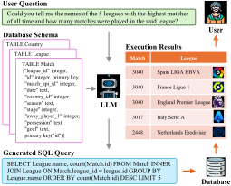
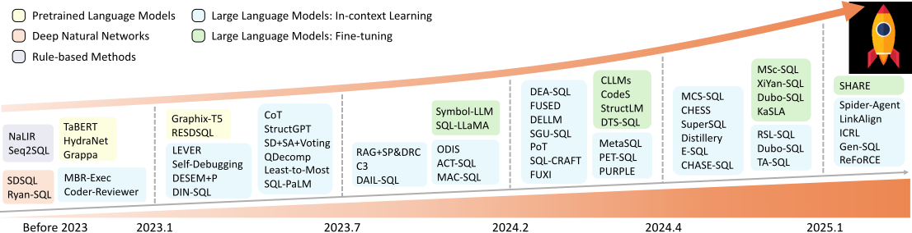

# Awesome-LLM-based-Text2SQL

<div align="center">
    <a href="https://awesome.re"></a>
    <a href="http://makeapullrequest.com"></a>
    <a href="http://makeapullrequest.com"></a>
    <a href="http://makeapullrequest.com"></a>
      <a href="http://makeapullrequest.com"></a>
</div>

This repository provides a comprehensive collection of research papers, benchmarks, and open-source projects on **large language model-based text-to-SQL (LLM-based Text-to-SQL)**. It includes all the contents from our survey paper *"[**Next-Generation Database Interfaces: A Survey of LLM-based Text-to-SQL**](https://arxiv.org/pdf/2406.08426)"* and will be continuously updated to incorporate the up-to-date advances and notable contributions from the text-to-SQL community. Stay tuned!!

🤗 **You are vey welcome to contribute to this repository** by launching an issue or a pull request. If you find any missing resources or come across interesting new research works, please don’t hesitate to open an issue or submit a PR!

📫 **Contact us via emails:**  `zijin.hong@connect.polyu.hk` or `qinggang.zhang@polyu.edu.hk`

## 🔥 News

* **[2025-09-14]** 🔥🔥 Repository launched based on our survey paper to keep track of recent progress in LLM-based text-to-SQL.
* **[2025-09-02]** 🎉🎉 Our paper *"Next-Generation Database Interfaces: A Survey of LLM-based Text-to-SQL"* has been **accepted by *IEEE Transactions on Knowledge and Data Engineering (TKDE)*!**
* **[2025-05-01]** 🎉🎉 Our paper *"Struture-Guided Large Language Models for Text-to-SQL Generation"* has been **accepted by *International Conference of Machine Learning (ICML)*!**

---

<div>
<h3 align="center">
       <p align="center"></p>
    <p align="center"><em>Overview of LLM-based Text-to-SQL Workflow </em></p>
</div>

A user asks a question about football leagues. The LLM takes this question with the schema of the corresponding database as input and generates an SQL query as output. The generated SQL is then executed on the database, retrieving the result *"The 5 leagues with the highest matches"*, which answers the user's question.

- **[Awesome-LLM-based-Text2SQL](#-awesome-llm-based-text2sql)**
  - **[📈 Trends](#-trends)**
  - **[📜 Surveys](#-surveys)**
  - **[🗃️ Datasets](#-datasets)**
    - [Original Datasets](#)
      - [Long-context](#)
    - [Post-annotated Datasets](#)
      - [Robustness](#)
  - **[🪴 Taxonomy](#-taxonomy)**
    - [In-cotext Learning](#)
      - [Decomposition](#)
    - [Fine-tuning](#)
      - [Pre-training](#)
  - **[📃 Citation](#-citation)**

---


## 📈 Trends

<div>
<h3 align="center">
       <p align="center"></p>
    <p align="center"><em>A Sketch of Research Trends in the Field of Text-to-SQL with Representative Works </em></p>
</div>

Before 2023, the focus is on a selection of representative traditional studies. However, from 2023 onward, the emphasis shifts to the rapid advancements driven by LLMs, marking a significant acceleration in the field.

## 🗃️ Datasets

## 📜 Surveys

## 🪴 Taxonomy

## 📃 Citation

```
@article{hong2024next,
  title={Next-generation database interfaces: A survey of llm-based text-to-sql},
  author={Hong, Zijin and Yuan, Zheng and Zhang, Qinggang and Chen, Hao and Dong, Junnan and Huang, Feiran and Huang, Xiao},
  journal={IEEE Transactions on Knowledge and Data Engineering},
  year={2024}
}
```

